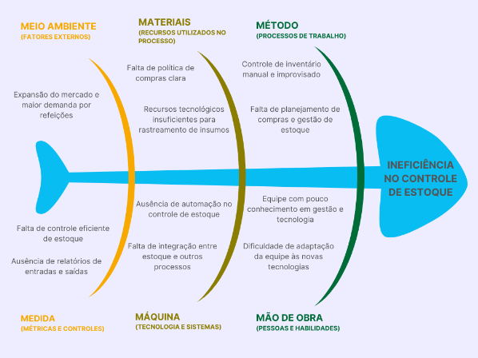

# CENÁRIO ATUAL DO CLIENTE E DO NEGÓCIO 

## 1.1 Introdução ao Negócio e Contexto 

A marmitaria Panelas Grill é uma empresa brasileira do setor alimentício, comprometida em oferecer refeições de qualidade a preços acessíveis. Com uma loja física em Brasília, a Panelas Grill se destaca pelo atendimento focado em sabor, conveniência e opções saudáveis. A empresa utiliza ingredientes frescos e selecionados, acreditando que é possível proporcionar uma alimentação equilibrada e nutritiva, sem abrir mão da qualidade. Seu compromisso é com a ideia de que todos podem comer melhor, de forma saudável e acessível.
A Panelas Grill tem como objetivo expandir seus negócios. Com foco em crescimento sustentável, a empresa busca diversificar seus serviços, investindo em inovação no cardápio e na melhoria contínua dos processos de produção e atendimento.

## 1.2 Identificação da Oportunidade ou Problema  

 A marmitaria Panelas Grill está em fase de expansão, conquistando novos clientes e ampliando seus negócios. No entanto, enfrenta desafios significativos no controle de estoques alimentícios, que impactam diretamente o fluxo de caixa. Esses desafios incluem a falta de recursos tecnológicos para rastreamento do estoque, ferramentas inadequadas para controle físico, ausência de uma estratégia clara para compras e procedimentos ineficazes para o planejamento de estoques, além da falta de conhecimento e treinamento em gestão pela equipe.
Como atuante no setor alimentício, a empresa precisa monitorar seus insumos com precisão para evitar desperdícios e otimizar a produção. A implementação de um sistema eficiente de gerenciamento de estoques é essencial para que a Panelas Grill mantenha uma operação ágil e lucrativa, oferecendo o suporte necessário para um controle eficaz e sustentável de seus estoques.

A Figura, a seguir apresenta o diagrama de Ishikawa contendo as causas e o problema da Panelas Grill. 

## 1.3 Desafios do Projeto 

 O desafio deste projeto é desenvolver um sistema de controle de estoque que leve em consideração as limitações da equipe. Como a equipe possui pouca familiaridade com tecnologias, é fundamental que o sistema seja simples e intuitivo. Isso significa que ele deve ser fácil de entender e usar, sem a necessidade de conhecimentos técnicos avançados. As funcionalidades precisam ser claras, diretas e acessíveis, garantindo uma experiência fluida, sem complexidade e adequada às necessidades dos usuários.

## 1.4 Segmentação de Clientes 
Os usuários finais são do tipo de segmento:

 <strong>  - Pessoas com mais de 40 anos:</strong> Muitas vezes, não teve contato com tecnologias desde cedo, o que pode representar um desafio no uso de sistemas mais complexos.
