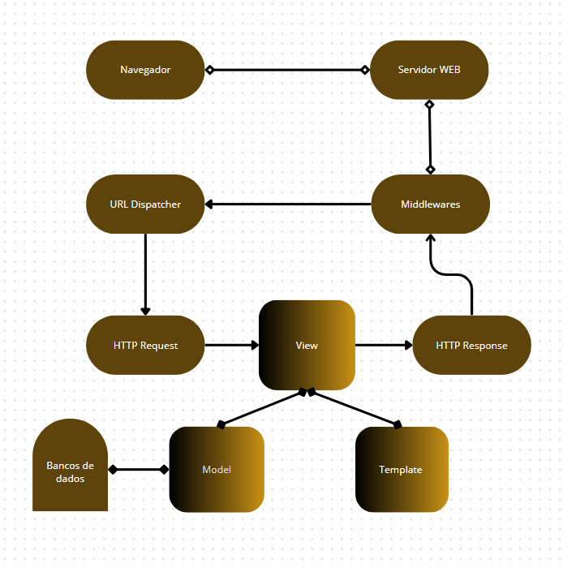

# **2. SOLUÇÃO PROPOSTA**

## **2.1 Objetivo do Produto**

O objetivo é simplificar e automatizar o controle de estoque da Panelas Grill, proporcionando um registro preciso e um monitoramento eficiente das entradas e saídas de insumos. Dessa forma, permitirá à empresa aprimorar a eficiência operacional, otimizar os fluxos de trabalho e gerar relatórios detalhados que servirão como base para decisões estratégicas, impulsionando o crescimento sustentável do negócio.

## **2.2 Características da Solução**

Aqui, tem-se um conjunto inicial das principais características que a solução deverá ter.

- 
Relatórios diários e mensais para análise de consumo e planejamento de compras.

- 
O sistema permitirá o registro eficiente de entrada e consumo de estoque, garantindo um controle preciso e atualizado dos produtos.

- 
Consulta rápida sobre a disponibilidade de produtos no estoque.

- 
O sistema notificará quando os itens estiverem em baixo estoque ou próximos ao vencimento.
- 
A plataforma será desenvolvida com foco em segurança, garantindo proteção de dados dos clientes e conformidade com a LGPD.

- 
Foco em uma interface simples e intuitiva, considerando a baixa familiaridade da equipe com tecnologia.

## **2.3 Tecnologias a Serem Utilizadas**

A proposta do projeto consiste no desenvolvimento de uma aplicação web, com foco em alta interação e acessibilidade para os usuários, independentemente do dispositivo utilizado. A solução será construída utilizando as seguintes tecnologias:

<ul>
    <li><strong>React:</strong>Framework para construção da interface de usuário, permitindo uma experiência dinâmica e responsiva.</li>
    <li><strong>Next.js:</strong>Framework para React, que facilita o desenvolvimento de aplicações web com renderização do lado servidor (SSR), otimização de desempenho e geração de páginas estáticas.</li>
    <li><strong>Tailwind CSS:</strong> Framework CSS utilitário que será usado para criar interfaces responsivas e modernas com mais rapidez. Ele oferece uma abordagem baseada em classes utilitárias, permitindo a personalização visual diretamente no HTML/JSX, eliminando a necessidade de escrever CSS personalizado para muitos casos.</li>    
    <li><strong>Django:</strong>Framework Python robusto e escalável, que será utilizado para a criação do back-end. Django oferece ferramentas nativas para gerenciamento de banco de dados, autenticação de usuários.</li>
    <li><strong>Git:</strong>Sistema de controle de versão distribuído, utilizado para gerenciar o código-fonte e colaborar na equipe de desenvolvimento.</li>
    <li><strong>Jest:</strong>Framework de testes JavaScript utilizado para garantir a qualidade e confiabilidade do código no front-end, com suporte a testes unitários, integração e cobertura de código.</li>
    <li><strong>PyUnit:</strong>Framework de testes para Python, utilizado para garantir a qualidade do back-end, permitindo a execução de testes unitários para validar a lógica da API desenvolvida com Flask.</li>
</ul>

# **Arquitetura de software**

## **padrão MTV (Model-Template-View)**

  

## **2.4 Pesquisa de Mercado e Análise Competitiva**

A análise de mercado mostra que, na região onde a Panelas Grill atua, os concorrentes principais são restaurantes e marmitas locais. Embora esses concorrentes atendam à demanda, eles ainda não adotaram soluções tecnológicas avançadas para a gestão de estoque e operações. Isso cria uma oportunidade para a Panelas Grill se modernizar e se destacar ao oferecer uma solução tecnológica mais eficiente.

<strong>Concorrentes Identificados:</strong>

<ul>
    <li><strong>Mobills:</strong> Focado em controle financeiro, mas não oferece recursos para controle de estoque, o que dificulta o monitoramento dos gastos com insumos e a análise de rentabilidade.</li>
    <li><strong>Estoque, Vendas, PDV, Finanças:</strong> Apresenta um design confuso e pouco intuitivo, dificultando a navegação e a compreensão das funcionalidades, o que impacta negativamente a experiência do usuário.</li>
</ul>

<strong>Diferenciação da Solução de Panelas Grill:</strong> A solução proposta se diferencia das soluções existentes no mercado por meio dos seguintes recursos inovadores:

<ul>
    <li><strong>Controle de Estoque:</strong> A plataforma permitirá o cadastro e a gestão eficiente dos cardápios, facilitando o controle de insumos e otimizando a administração do inventário, além de registrar a entrada e saída de insumos.</li>
    <li><strong>Interface Intuitiva e de Fácil Navegação:</strong> Com um design focado na simplicidade, o sistema será fácil de usar, garantindo uma experiência positiva e eficiente para os usuários.</li>
</ul>

## **2.5 Análise de Viabilidade**

A equipe de desenvolvimento possui um bom conhecimento das tecnologias necessárias, embora ainda esteja em processo de aprofundamento e familiarização com algumas delas. No entanto, isso não comprometerá a capacidade de implementar as soluções propostas. Para garantir o progresso contínuo, serão realizadas sprints, permitindo o desenvolvimento ágil e entregas rápidas de funcionalidades ao longo do projeto.

A equipe se comprometerá a atender todos os requisitos do projeto e a cumprir os objetivos estabelecidos. Além disso, haverá uma comunicação constante com os clientes para garantir que as entregas atendam às expectativas e sejam realizadas conforme o planejado, ajustando o trabalho conforme necessário para atender aos objetivos do projeto.

## **2.6 Impacto da Solução**

Com a implementação do sistema, espera-se que traga benefícios para a Panelas Grill como:

<ol>
    <li><strong>Redução de Perdas:</strong> A notificação de vencimento e o monitoramento automatizado evitam o desperdício de insumos.</li>
    <li><strong>Melhoria no Planejamento:</strong> Relatórios detalhados permitem uma previsão mais precisa de demanda, reduzindo excessos ou faltas.</li>
    <li><strong>Eficiência Operacional:</strong>  A automatização elimina o trabalho manual e reduz erros no registro de insumos.</li>
    <li><strong>Tomada de Decisão Informada:</strong> Com relatórios confiáveis, a empresa terá maior clareza para decidir sobre compras e uso de recursos.</li>
    <li><strong>Apoio ao Crescimento:</strong> Com um estoque bem gerenciado, a Panelas Grill poderá atender a demandas maiores sem interrupções.</li>    
</ol>

## Historico de Versão 
| Data       | Versão | Descrição                                             | Autor      |
|------------|--------|-------------------------------------------------------|------------|
| 10/10/2024 | 1.0    | Documento inicial  | Grupo    |
| 24/10/2024 | 1.1    | Correção dos feedbacks levantados pelo professor  |   Marcos Vieira      |
| 15/12/2024 | 1.2    | Adição do diagrama da arquitetura de software     | Pablo|
| 18/01/2025 | 2.1    | Atualizando o tópico 2.1     | Jose Vinicius |

